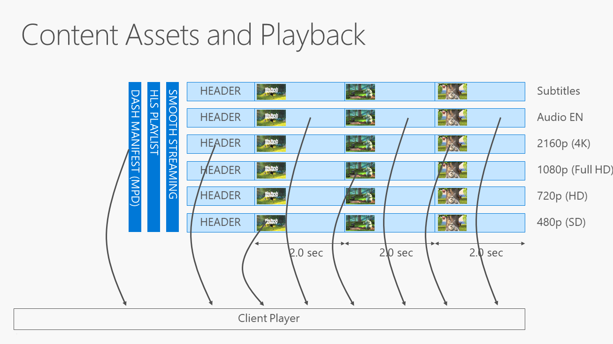

 ---
author: 
title: "Content Encryption and Delivery"
description: ""
ms.assetid: "7E87CB5D-59E1-4E25-8271-82FB97998ECD"
kindex: content, encryption and delivery
kindex: encryption, and content delivery
kindex: content, encryption and delivery
keywords: content, encryption, delivery
ms.author: 
ms.topic: conceptual
ms.prod: playready
ms.technology: drm
---

# Content Encryption and Delivery
   
  
The basic capability of PlayReady is to protect content from unwanted malicious attacks. To do this, your content must first be encrypted and an associated PlayReady header inserted in the content. You can either design this system yourself, or you could contract with a [PlayReady Partner](https://www.microsoft.com/playready/partners/) to supply this functionality for you.

This topic describes various ways to encrypt and deliver your content using PlayReady.

## Inserting the DRM header

All encrypted content protected by PlayReady must have a PlayReady Header inserted in your encrypted file. This PlayReady Header is used by a PlayReady client to locate or acquire a license for that particular piece of content. A PlayReady Header is composed of XML strings encoded using UTF-16. It also includes the key identifiers (KIDs) that are used to encrypt the content, as well as any custom attributes. 

Any encoder that packages clear content needs to implement a PlayReady Header generator to build the header and embed it in the encrypted content. How you do this is entirely up to you; Microsoft does not supply this functionality. The PlayReady Header must be implemented according to the [PlayReady Header Object Specification](https://www.microsoft.com/playready/documents/).

Your encrypted content can contain multiple DRM headers, including PlayReady Headers along with third-party DRM headers. For more information on how this works, see [Using Encryption Tools](#encryptiontoools).

## Encryption tools

Microsoft does not include an encryptor with PlayReady. Instead, PlayReady works with standards in which services commonly use common encryption. Therefore the encryption format is not PlayReady specific, rather it's a function of the file format. 

Basically, you could either create your own encrypter that inserts the PlayReady Header in the encrypted file, or you could work with any type of open source encryptor (such as ffmpeg or MP4Box). In addition, you could work with a professional encoder company if you want to encrypt content with PlayReady. 

## Using encryption tools

Typically, the process to encrypt an asset with multiple DRMs or common technologies is going to use common encryption. This process is basically the same as described in [Basic encryption and licensing process](basicpurposeofplayready.md#basicprocess), except that the particular key that is going to be used to encrypt the asset is going to be published in a header for PlayReady (and this header is not going to include the value of the key, but is going to include the value of the KID). Then other headers are going to be potentially included in the asset for other DRMs. All those headers will have their own syntax that designates the KID or the information required to ultimately access the content key. But the content key for this asset is going to be the same for all the DRMs.

## Using encryption keys

There are many different ways to encrypt the your assets. The simplest one to the most sophisticated one depends on how much you want to invest in the system and what the needs of the service are.

The preceding figure shows an example of an adaptive streaming asset. It has four different video qualities, one audio track, and one subtitle track. It is one asset that is served in multiple different formats depending on what the client would prefer to play back. Smooth Streaming, HLS, and DASH are the most common variants to be used, typically based on fragmented MP4 files. So, basically the client is going to prograssively acquire different quality fragments of the asset depending on the network and heuristics of the client, so that it is able to play video and audio smoothly. <<Original transcription - "So there is a little bit of a <mission?> here to say, you know what, the client is going to progressively acquire fragments - that's a fragmented asset - depending on the <mumble> and heuristics of the client, and to play video and audio smoothly.">>

The simplest way to encrypt these assets would be to use a single content key to encrypt everything (typically subtitles are not encrypted - it's not against any rule, but they are usually kept in the clear). Using one content key makes life easy for the license server because the license server basically has to deliver one key. This key would typically be acquired by the client before playback occurred. 

As a side note, PlayReady has a concept of proactive versus reactive license acquisitions. A proactive license acquisition occurs when the client initiates a license request before playback begins. This is typically a scenario where the system is programmed such that the application has browsed content, decided to play, would take the time to acquire the license, and when the license is received, start playback. The application could start playback immediately, or there are cases where the license would be acquired days before the content is actually played, typically in a on the fly scenario. In reactive license acquisition, the application doesn't acquire a license before the content is played back. Instead the application will start playback and rely on the player to actually discover that the content is encrypted and is missing the key, and a license has not been acquired previously.

There have been some enhancements in the past years to mulitiply the number of keys being used, mostly driven by the requirement to allow only certain highest-robustness clients to consume the highest quality content. With the arrival of Ultra HD (4K) content, and with the addition of high dynamic range (HDR) for higher color content, there was a need by studios and services to allow the highest quality only on certain clients, which typically have hardware DRM built in. So there was a requirement to use different keys for the highest video quality. In this case, at a minimum, two keys would have to be delivered to a client before the client would be allowed to play the highest quality of the asset. 

And, that has been enhanced a little bit and now it is common practice to use a different key for all of the different tracks of a single asset so that, as a service, you keep the ability to deliver the keys that you want to restrict the tracks for a certain client.

Another advance in functionality is rotating the key (with PlayReady and other DRMs as well). You could decide to change the key every fragment, or less frequently, typically at program boundaries. If you are a service, a broadcaster for example, you might have free to air content that you want everyone to have access to, but that you still want to have encrypted and protected, and you have some content that is restricted to your subscribers. In this case, you would probably want to rotate the key at program boundaries so that you deliver the free to air key to everyone without any restrictions, and change the key when the subscriber content is actually aired to restrict who gets to see that content. 

There are different use cases where the service will want to rotate the key at some point. The way that is demonstrated in the previous figure is basically to rotate the key and let the client request the content keys again. That's called license rotation. However, it is not a very scaleable way to issue licenses because all the clients have to request the next key every time the key rotates. This method is still acceptable if you have a system with key rotation every 30 minutes or every hour at program boundaries because this method would not generate a high volume of keys or key requests. The problem with this mechanism is that all of the clients are requesting new keys at exactly the same time, and the volume of requests could overload the license server. So, for broadcast (live linear TV) it's probably not a very good way to scale if you have a large number of clients. 

The previous method could be acceptable under some restrictions and some services use that method, but there is an advanced mechanism in PlayReady called key rotation (as opposed to license rotation). This method stores an embedded license store (ELS) in the stream of the actual content. In this mechanism, the key used to encrypt the ckA2 fragment itself is called a root key, and there is only one root key per stream (for example kidRA). There is a single root key for the entire track or for the entire asset that is preacquired once by each client. In addition, the ELS contains an encrypted version of the content key for the next fragment. With this method, when the key for the next fragement is rotating (for example, between ckA1 and ckA2), you actually have an encrypted version of the content key available for the next fragment (ckA2) inside the ELS in the previous fragment (ckA1). So, when the client that wants to decrypt the ckA2 fragment, the client only has to decrypt the ELS from fragment ckA1 to access a key that will let them access ckA2, as opposed to having to request a key for ckA2 from the license server. Because the the key for ckA2 is basically included in the ELS in the stream, so there is no license request required at this rotation time from any client. This key in the ELS is encrypted because it would be too easy to defeat if it were in the clear. 

For example, let's say this asset is live linear TV. When the client tries to connect, the client would acquire a root license that it identifies as a PlayReady scaleable license for live linear TV. The client then finds the kidRA in the header of the stream and requests that key, but that key does not give the client the content key to play the fragments immediately, as in a standard license mechanism. Instead, it gives the client a key that will help decrypt the next ELS, which will then give the client the content key. If you are familiar with MPEG-2 TS and the control word encryption, this is a similar mechanism except for the encryption is much stronger and is also more flexible.

