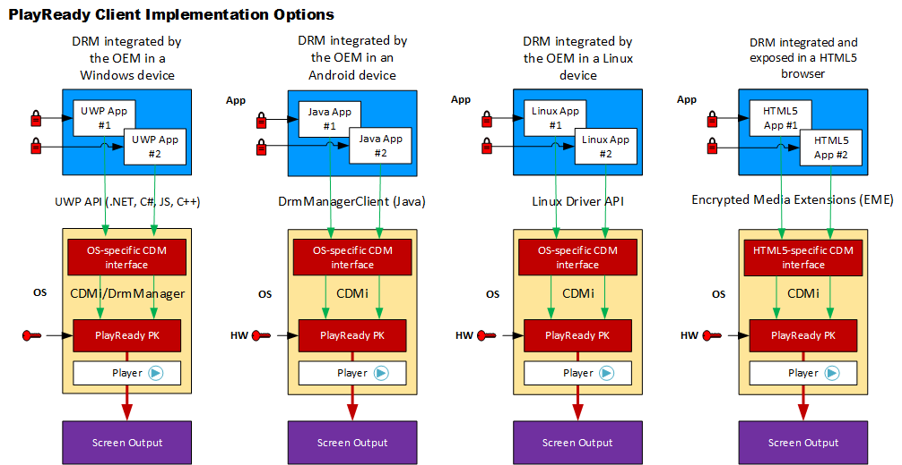

# PlayReady in Clients
   
  
This topic provides a brief description the different ways to implement a DRM client in a device, how to develop applications using DRM, and gives details of the overall PlayReady Device Porting Kit structure.

A PlayReady client can be either a device or an application that receives content for playback. The PlayReady Device Porting Kit is intended for original equipment manufactures (OEMs) who are developing devices (such as physical hardware or operating systems), and for application developers who are integrating their applications in a device. 

The following figure shows the client implementation options available using PlayReady.

A device that is embedding a DRM client (using the Content Decryption Module (CDM)) exposes an API to applications that has different forms. Some of these forms are:

   *  On Windows 10 UWP, the **Windows.Media.Protection.PlayReady** namespace is available in C#, JavaScript, and C++. See [Windows.​Media.​Protection.​Play​Ready Namespace](https://docs.microsoft.com/en-us/uwp/api/Windows.Media.Protection.PlayReady) for more information.
   
      *  For more information on using PlayReady for Windows 10, see [PlayReady DRM](https://docs.microsoft.com/en-us/windows/uwp/audio-video-camera/playready-client-sdk).
      
      *  For more information on using PlayReady for Windows 8, see [Developing PlayReady Windows 8.1 Store and Web Apps](https://msdn.microsoft.com/en-us/library/windows/apps/xaml/dn468834.aspx).

   *  On HTML5, the [Encrypted Media Extensions (EME)](http://www.w3.org/TR/encrypted-media/).
   
   *  On Android, the [**DrmManagerClient** class](https://developer.android.com/reference/android/drm/DrmManagerClient.html). See the [PlayReady DRM Plugin for Android Microsoft Specification](../Specifications/PlayReady_DRM_Plugin_for_Android/playreadydrmpluginforandroidspecification.md) for more information.  

